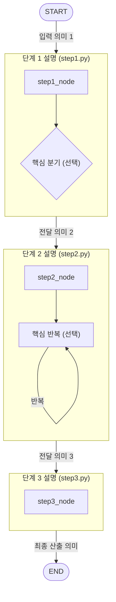

# 에이전트용 에이전트 머메이드 다이어그램 작성 가이드

# 목차
- [서론](#서론)
- [본론](#본론)
- [결론](#결론)
- [참조목록](#참조목록)

# 서론
이 문서는 여러 에이전트 워크플로우를 동일한 기준으로 시각화하기 위한 Mermaid 작성 표준이다.
목표는 가독성, 비교 가능성, 유지보수성을 동시에 확보하는 것이다.

# 본론

# 기본 원칙
- 다이어그램 방향은 `flowchart TB`를 기본으로 사용한다.
- 예외 처리 경로는 기본 다이어그램에서 제외한다.
- 노드는 함수 단위로 표현한다.
- 단계별로 서브그래프를 나누고, 간선은 서브그래프 간에만 연결한다.
- 간선 라벨은 변수명이 아닌 의미 중심 문구로 작성한다.
- `+기존 상태` 같은 포괄 문구는 사용하지 않는다.
- 시작과 종료는 `START`/`END` 노드로 명시한다.

# 작성 기준
- 본 문서는 축약형 단일 표준만 사용한다.
- 비공개 함수는 포함하지 않는다.
- 루프/분기는 단계당 최대 1개만 사용한다.
- 복잡한 내부 흐름은 텍스트 설명으로 대체한다.

# 서브그래프 표기 규칙
- 서브그래프 제목은 한 줄로 작성한다.
  - 형식: `서브그래프 설명 (file_name.py)`
- 서브그래프 내부 노드는 함수명만 표기한다.
- 서브그래프 내부 노드는 2~4개 수준으로 유지한다.
- 동일 파일에 정의된 함수는 하나의 서브그래프에 함께 배치한다.
- 제목과 노드 겹침 방지를 위해 제목 뒤에 줄바꿈 여백을 넣는다.
  - 예: `  `
- 각 서브그래프 내부 방향은 `direction TB`로 고정한다.

# 루프/분기 표기 규칙
- 분기는 필요할 때만 다이아몬드 노드로 표기한다.
  - 예: `D{입력 유효?}`
- 루프는 반복 대상이 드러나는 라벨로 표기한다.
  - 예: `N -- "다음 항목 반복" --> N`
- 루프/분기 라벨은 구현 변수명보다 처리 의미를 우선한다.
  - 예: `파일 메타 존재`, `남은 엣지 있음`, `반복 종료`
- 중첩 루프/다중 분기는 생략하고 대표 흐름만 유지한다.

# 간선 라벨 규칙
- 금지: 내부 키/변수명 중심 라벨
  - 예: `repository_url`, `py_files`, `metrics`
- 권장: 데이터의 업무 의미 중심 라벨
  - 예: `분석 대상 저장소 주소`, `로컬 저장소 위치`, `핵심 호출 지표`
- 라벨은 한눈에 읽히는 길이로 짧게 유지한다.

# 작성 절차
1. 그래프 정의 파일에서 노드 등록 순서를 확인한다.
2. 각 노드 함수와 파일명을 매핑한다.
3. 비공개 함수는 다이어그램 노드에서 제외한다.
4. 루프/분기는 단계별 대표 1개만 선별한다.
5. 동일 파일 함수끼리 하나의 서브그래프로 묶는다.
6. 단계별 입력/출력 의미를 짧은 문구로 정의한다.
7. 서브그래프 제목을 `설명 (파일명.py)` 형식으로 작성한다.
8. 간선을 서브그래프 간으로 연결하고 의미 라벨을 부여한다.
9. 렌더링 후 겹침이 있으면 제목의 ` ` 개수를 조정한다.

# 표준 템플릿

# 품질 체크리스트
- [ ] `flowchart TB`를 사용했는가?
- [ ] 예외 처리 경로를 제외했는가?
- [ ] 노드가 함수명으로 표기되었는가?
- [ ] 비공개 함수가 다이어그램에서 제외되었는가?
- [ ] 서브그래프 제목이 `설명 (파일명.py)` 한 줄 형식인가?
- [ ] 동일 파일 함수가 하나의 서브그래프로 묶였는가?
- [ ] 간선이 서브그래프 간 연결인가?
- [ ] 라벨이 변수명이 아닌 의미 중심인가?
- [ ] 루프/분기를 대표 흐름만 남겨 단순화했는가?
- [ ] 제목/노드 겹침이 없는가?

# 결론
본 가이드를 적용하면 에이전트별 구현 차이가 있어도 다이어그램 표현 방식이 일관되게 유지된다.
결과적으로 팀 내 문서 품질과 워크플로우 이해 속도를 함께 높일 수 있다.

# 참조목록
- `app/agents/repository_agent/graph.py` (20:33): 노드 등록/간선 연결 순서 기준
- `app/agents/repository_agent/graph.py` (48:65): 실행 흐름 및 상태 전달 맥락
- `app/agents/repository_agent/states/repository_state.py` (4:15): 상태 키 정의 기준
